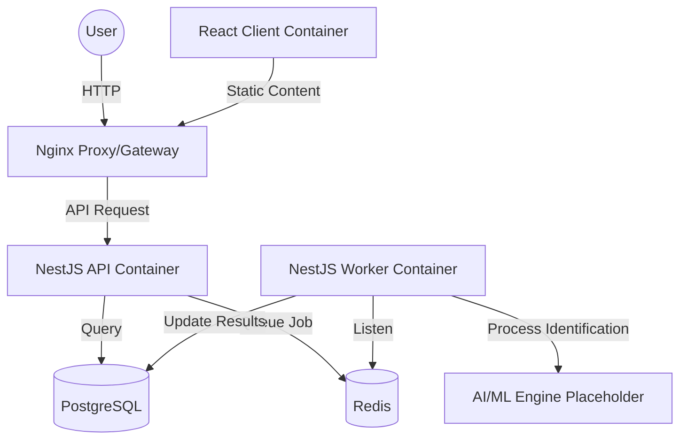

# Voice Identify Service - Monorepo Overview

Welcome to the **Voice Identify Service** monorepo. This project is a comprehensive platform for voice biometric identification, featuring a high-performance backend, a background processing worker, and a modern frontend client.

---

## 🏗️ Project Architecture

This project is built as a **Turborepo Monorepo** managed by **pnpm workspaces**. This structure allows for shared configurations, efficient dependency management, and centralized orchestration of multiple services.

### Core Components

1.  **Backend (API & Worker)**: Located in `apps/api`.
    - **API**: A NestJS-based RESTful service providing authentication, voice profile management, and identification session orchestration.
    - **Worker**: A background job processor using BullMQ (Redis) to handle computationally intensive voice identification tasks.
2.  **Frontend (Client)**: Located in `apps/client`.
    - A React-based interface (cloned from `voice-identity-fe`) for users to interact with the service, upload voices, and view identification results.
3.  **Shared Resources**:
    - **Database**: PostgreSQL 15, managed via Prisma 7.
    - **Cache/Queue**: Redis 7, used for BullMQ job queueing and potential caching.
    - **Infrastructure**: Orchestrated using Docker and Docker Compose.

---

## 📁 Directory Structure

```text
.
├── apps
│   ├── api                 # NestJS Backend (API + Worker)
│   │   ├── prisma          # Prisma schema and migrations
│   │   ├── src
│   │   │   ├── common      # Global filters, guards, interceptors
│   │   │   ├── config      # Dynamic configuration system
│   │   │   ├── database    # Prisma & Redis providers
│   │   │   ├── module      # Feature modules (Auth, Voices, Identify)
│   │   │   ├── shared      # Global interfaces and utilities
│   │   │   ├── workers     # Background processor and entry point
│   │   │   ├── main.ts     # API entry point
│   │   │   └── worker.main.ts # Worker entry point
│   │   └── Dockerfile      # Multi-stage production build
│   └── client              # React Frontend Client
│       ├── src             # Frontend source code
│       └── vite.config.ts  # Vite configuration
├── packages
│   ├── eslint-config       # Shared ESLint rules
│   └── typescript-config   # Shared TSConfig bases
├── .github
│   └── workflows           # CI/CD (GitHub Actions)
├── .husky                  # Git hooks (Commitlint, Lint-staged)
├── docker-compose.yml      # Full-stack orchestration
└── pnpm-workspace.yaml     # Workspace definition
```

---

## 🛠️ Getting Started

### Prerequisites

- **Node.js**: v20 or higher.
- **pnpm**: v9 or higher.
- **Docker**: For running the database and Redis.
- **Task Runner**: [Turborepo](https://turbo.build/repo/docs/installing) (optional, but recommended).

### Installation

1.  **Clone the repository**:

    ```bash
    git clone <repository-url>
    cd voice-identify-monorepo
    ```

2.  **Install dependencies**:

    ```bash
    pnpm install
    ```

3.  **Environment Setup**:
    Copy the example environment file at the root:

    ```bash
    cp .env.example .env
    ```

4.  **Database Synchronization**:
    Start the database and Redis containers:
    ```bash
    pnpm infra:up
    ```
    Generate the Prisma client:
    ```bash
    pnpm prisma:generate
    ```

---

## 🔐 Login Feature Setup

- Team checklist sau khi pull để login chạy ổn định: `docs/dev-login-setup.md`

---

## 🚀 Development Scripts

The monorepo uses centralized scripts in the root `package.json` to manage all apps and packages.

### Global Tasks

- `pnpm dev`: Runs both API and Client in development mode via Turbo.
- `pnpm build`: Builds all applications for production.
- `pnpm lint`: Lints the entire codebase.

### Backend-Specific

- `pnpm dev:api`: Starts the NestJS API with hot-reload.
- `pnpm dev:worker`: Starts the background worker.
- `pnpm prisma:migrate`: Runs database migrations.

### Frontend-Specific

- `pnpm dev:client`: Starts the frontend development server.

---

## 🛡️ Development Standards

### Git Hooks & Quality Control

We use **Husky** and **lint-staged** to ensure code quality before every commit.

- **Commitlint**: Enforces [Conventional Commits](https://www.conventionalcommits.org/).
- **Prettier**: Enforces consistent code formatting.
- **ESLint**: Enforces project-specific coding standards.

#### Commit Message Conventions

We follow the **Conventional Commits** specification. Every commit message must follow this structure:

```text
<type>[optional scope]: <description>

[optional body]

[optional footer(s)]
```

**Allowed Types:**

| Type       | Description                                                                                                                 |
| :--------- | :-------------------------------------------------------------------------------------------------------------------------- |
| `feat`     | A new feature                                                                                                               |
| `fix`      | A bug fix                                                                                                                   |
| `docs`     | Documentation only changes                                                                                                  |
| `style`    | Changes that do not affect the meaning of the code (white-space, formatting, missing semi-colons, etc)                      |
| `refactor` | A code change that neither fixes a bug nor adds a feature                                                                   |
| `perf`     | A code change that improves performance                                                                                     |
| `test`     | Adding missing tests or correcting existing tests                                                                           |
| `build`    | Changes that affect the build system or external dependencies (example scopes: gulp, broccoli, npm)                         |
| `ci`       | Changes to our CI configuration files and scripts (example scopes: GitHub Actions, Travis, Circle, BrowserStack, SauceLabs) |
| `chore`    | Other changes that don't modify src or test files                                                                           |
| `revert`   | Reverts a previous commit                                                                                                   |

**Example:** `feat(api): add voice identification endpoint`

### Branching Model

- `main`: Production-ready code.
- `develop`: Integration branch for features.
- `feature/*`: Branch for new features.
- `hotfix/*`: Branch for hotfixes.
- `fix/*`: Branch for bug fixes.

---

## 🐳 Infrastructure & Deployment

### Production Orchestration

The project is containerized using a multi-stage `Dockerfile` and `docker-compose.yml`.



### CI/CD

We use **GitHub Actions** for our CI pipeline:

1.  **Lint**: Checks code formatting and standards.
2.  **Type-Check**: Verifies TypeScript safety.
3.  **Build**: Ensures the project builds successfully in a clean environment.

---

## 🧠 Business Logic & Use-Case Pattern

The project follows a **Clean Architecture** approach using the **Use-Case Pattern**. Instead of bloated services, every business action is encapsulated in a specific class.

### Example: RegisterUserUseCase

Located in `apps/api/src/module/auth/use-cases/register-user.usecase.ts`:

1.  **Validate input**: Check if user exists.
2.  **Secure data**: Hash the password using bcrypt.
3.  **Persist**: Save the account to the database via Prisma.
4.  **Return**: Return the created user (masking sensitive data).

### Benefits:

- **Testability**: Each use-case can be unit-tested in isolation.
- **Readability**: Clear boundaries for business logic.
- **Maintainability**: Changes in one feature don't impact others.

---

## 🤝 Contribution Guide

We welcome contributions to the **Voice Identify Service**! To maintain code quality and consistency, please follow these guidelines:

### 1. Development Process

- Always create a new branch from `develop`.
- Ensure your code follows the established ESLint and Prettier rules.
- Write meaningful commit messages using the **Conventional Commits** format.
- Update documentation in the relevant `OVERVIEW.md` files if your changes affect the architecture or features.

### 2. Pull Request Requirements

- Describe your changes in detail in the PR description.
- Include screenshots or recordings for UI changes.
- Ensure all CI checks (Lint, Build, Type-Check) pass.
- Request reviews from the core engineering team.

---

## 🗺️ Project Roadmap

### Phase 1: Foundation (Completed)

- [x] Monorepo structure setup (Turborepo + pnpm).
- [x] API & Worker consolidation.
- [x] Database schema & Prisma 7 integration.
- [x] Basic Auth, Voices, and Identify modules.

### Phase 2: AI Integration (Ongoing)

- [/] Integration with advanced voice embedding extraction models.
- [ ] Real-time identification streaming.
- [ ] Multi-voice separation and identification logic.

### Phase 3: Advanced Features (Planned)

- [ ] Admin Dashboard for voice profile analytics.
- [ ] Webhook notifications for completed sessions.
- [ ] Mobile application (React Native) implementation.

---

## 📄 Licensing & Permissions

This project is private and intended for use by the **Voice Identify Team** only. All rights reserved.

---

## 📞 Support & Documentation

For more detailed information, please refer to the specific overviews:

- [API Overview](file:///home/trh_thanh30/Documents/indentify-voice-base/apps/api/OVERVIEW.md)
- [Client Overview](file:///home/trh_thanh30/Documents/indentify-voice-base/apps/client/OVERVIEW.md)
