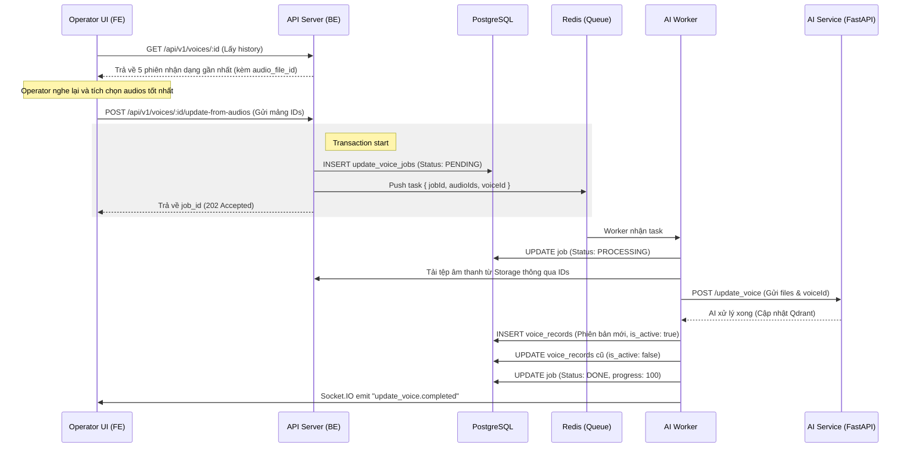

# Workflow: Cập nhật đặc trưng giọng nói (Biometric Update)

Tài liệu này hướng dẫn chi tiết quy trình **UC04 — Cập nhật đặc trưng giọng nói** từ các mẫu âm thanh lịch sử. Đây là quy trình phức tạp nhất trong module Voices, đòi hỏi sự phối hợp chặt chẽ giữa Frontend (FE), Backend (BE), và AI Worker.

---

## 1. Tổng quan quy trình (Conceptual Workflow)

Mục tiêu của quy trình này là cải thiện độ chính xác của việc nhận diện bằng cách cung cấp cho AI những mẫu âm thanh mới nhất và tốt nhất của người dùng, mà không bắt người dùng phải thực hiện quy trình đăng ký (Enroll) thủ công lại từ đầu.

### Sơ đồ luồng (Sequence Diagram)



---

## 2. Hướng dẫn dành cho Frontend (Frontend Guide)

Quy trình này đòi hỏi FE phải xử lý logic trạng thái (State Management) phức tạp.

### 2.1 Thu thập dữ liệu đầu vào (UX Selection)

Trên trang chi tiết hồ sơ (`/voices/:id`):

1. Hiển thị danh sách các phiên nhận dạng trong mục `identify_history`.
2. Cho phép Operator nghe lại (Play) từng mẫu audio thông qua `audio_file_id`.
3. Cung cấp checkbox để Operator chọn từ 1 đến 5 mẫu âm thanh được đánh giá là **Rõ nét nhất**.
4. Nút "Cập nhật đặc trưng" chỉ được kích hoạt khi có ít nhất 1 mục được chọn.

### 2.2 Gửi yêu cầu cập nhật

FE gọi API `POST /api/v1/voices/:id/update-from-audios`:

- **Params**: `id` của user.
- **Body**: `{ "audioIds": ["uuid-1", "uuid-2", ...] }`.
- **Response**: Nhận về `{ "job_id": "uuid-job" }`.

### 2.3 Theo dõi tiến độ (Monitoring)

Vì đây là tác vụ nền (Background Job), FE không nên khóa màn hình người dùng. FE nên:

1. Hiển thị một Progress Bar hoặc biểu tượng trạng thái "Đang cập nhật" trên Profile của người dùng.
2. **Cơ chế WebSocket**: Lắng nghe sự kiện qua Socket.IO:
   ```javascript
   socket.on('update_voice.progress', (data) => {
     if (data.job_id === currentJobId) {
       updateProgressBar(data.progress);
     }
   });
   ```
3. **Cơ chế Polling (Dự phòng)**: Nếu mất kết nối Socket, FE nên gọi `GET /api/v1/jobs/:job_id` mỗi 3-5 giây để cập nhật trạng thái UI.

---

## 3. Hướng dẫn dành cho Backend & Worker

### 3.1 API Server (Validation Layer)

- Kiểm tra User có tồn tại và đang ở trạng thái `ACTIVE`.
- Kiểm tra toàn bộ `audioIds` gửi lên có thực sự thuộc về `identify_sessions` của User đó không (Ngăn chặn việc lấy trộm giọng nói của người khác để update cho mình).
- Tạo bản ghi trong bảng `update_voice_jobs` để lưu vết.

### 3.2 AI Worker (Processing Layer)

Worker là một tiến trình Node.js riêng biệt sử dụng BullMQ:

1. **Lấy dữ liệu**: Đọc thông tin các tệp âm thanh từ bảng `audio_files`.
2. **Streaming**: Stream dữ liệu âm thanh tới **AI Service** (`/update_voice/`).
3. **Hậu xử lý (Post-processing)**:
   - Khi AI Service trả về thành công, Worker phải thực hiện cập nhật Database.
   - Bản ghi `voice_records` mới sẽ được tạo ra, trỏ vào mẫu âm thanh tập hợp mới.
   - Bản ghi `voice_records` cũ bị đánh dấu `is_active = false`.
   - Điều này đảm bảo tính **Atomic** (Nguyên tử): Nếu AI lỗi, dữ liệu cũ vẫn hoạt động bình thường.

---

## 4. API Reference

### POST /api/v1/voices/:id/update-from-audios

#### Request Body:

| Tham số    | Loại          | Yêu cầu  | Mô tả                                           |
| :--------- | :------------ | :------- | :---------------------------------------------- |
| `audioIds` | `Array<UUID>` | Bắt buộc | Danh sách ID các tệp audio từ lịch sử sessions. |

#### Hoạt động thành công (202 Accepted):

```json
{
  "statusCode": 202,
  "message": "Yêu cầu cập nhật đã được đưa vào hàng đợi!",
  "data": {
    "job_id": "8d4be585-...",
    "status": "PENDING",
    "created_at": "2026-04-10T23:00:00Z"
  }
}
```

---

## 5. Ràng buộc & Chỉ số chất lượng

### 5.1 Giới hạn số lượng âm thanh

Hệ thống khuyến nghị chọn từ **2 đến 3 mẫu âm thanh** khác nhau để AI có cái nhìn đa chiều về giọng nói của đối tượng (Morning voice, Evening voice, Emotional range).

### 5.2 Thời gian xử lý (SLA)

- Thời gian trung bình: **5 - 10 giây**.
- Thời gian tối đa (Timeout): **60 giây**. Nếu vượt quá, job sẽ được đánh dấu là `FAILED` và Operator cần thực hiện lại.

### 5.3 Rollback Policy

Nếu tiến trình tại AI Service thất bại (Mất kết nối Qdrant, file hỏng), Worker sẽ:

1. Không thay đổi trạng thái `is_active` của bản ghi cũ.
2. Đánh dấu Job status là `FAILED` kèm theo lý do lỗi chi tiết trong trường `error_log`.
3. Gửi thông báo "Cập nhật thất bại" tới Frontend qua Socket.

---

## 6. Xử lý sự cố (Troubleshooting)

- **Lỗi 404**: `audio_file_id` không tồn tại hoặc đã bị xóa vật lý khỏi Storage.
- **Lỗi 409 Conflict**: Đang có một job cập nhật khác đang chạy cho cùng một User này. Operator phải đợi job hiện tại hoàn tất.
- **Progress đứng yên**: Kiểm tra Worker Service có đang chạy không (Sử dụng lệnh `pm2 status` hoặc `systemctl status`).

---
