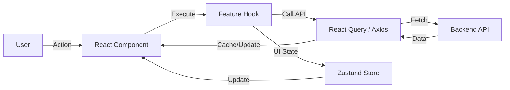

# 🎨 Voice Identify Service - Frontend Client Overview

The frontend of the **Voice Identify Service** is a modern, reactive, and highly modular web application. It is built using the latest industry standards to provide a seamless user experience for voice profile management and identification.

---

## 🏗️ Architecture: Feature-Based Modular Pattern

This project follows a strict **Feature-Based Modular Pattern**. Instead of grouping files by type (e.g., all components in one folder, all hooks in another), we group them by business feature. This makes the codebase highly scalable and easy to navigate.

### Directory Structure Explained

```text
apps/client/src
├── api/                # Global Axios instance & interceptors
├── components/         # Shared generic UI components
│   └── ui/             # shadcn/ui base components
├── configs/            # Application constants and configuration
├── feature/            # ⭐ The Core: Feature-specific modules
│   └── voice/          # Voice Profile Feature
│       ├── api/        # Feature-specific API calls (React Query)
│       ├── components/ # Components unique to this feature
│       ├── hooks/      # Business logic encapsulated in hooks
│       ├── schemas/    # Zod validation schemas for forms
│       ├── types/      # Feature-specific TypeScript interfaces
│       └── store/      # Zustand store for feature state
├── hooks/              # Global reusable utility hooks (e.g., useTheme)
├── layouts/            # Page layout wrappers (Main, Auth, Dashboard)
├── libs/               # Third-party library initializations
├── pages/              # Route-level components
├── types/              # Global shared TypeScript types
└── utils/              # Helper functions (Formatters, Validators)
```

---

## 🚀 Tech Stack Deep Dive

### Core Frameworks

- **React 19**: Utilizing the latest features of React, including improved hook performance and server component preparation.
- **Vite**: The next-generation frontend tool for lightning-fast development and optimized production builds.
- **TypeScript**: Ensuring type safety across the entire application, minimizing runtime errors.

### Styling & UI

- **Tailwind CSS v4**: Leveraging the latest engine for high-performance utility-first styling.
- **shadcn/ui**: A collection of re-usable components built using **Radix UI** primitives and Tailwind CSS.
- **Lucide React**: A beautiful and consistent icon library.

### State Management & Data Fetching

- **TanStack React Query v5**: Managing server state, caching, synchronization, and data lifecycle.
- **Zustand**: A small, fast, and scalable bearbones state-management solution for global UI state (e.g., sidebar collapse, user session).

### Form Management & Validation

- **React Hook Form**: Performant, flexible, and extensible forms with easy-to-use validation.
- **Zod**: TypeScript-first schema declaration and validation library.

---

## 📡 API Integration & Error Handling

We use **Axios** as our HTTP client, configured with custom interceptors to handle authentication and response normalization automatically.

### Axios Interceptor Logic

Located in `src/api/index.ts`, the interceptor handles:

1.  **Request**: Automatically attaches the JWT `Authorization: Bearer <token>` from the storage.
2.  **Response**: Unwraps the standard backend response format (e.g., `response.data.data`).
3.  **Error Handling**: Detects `401 Unauthorized` errors and automatically redirects the user to the login page or attempts a token refresh.

### Example React Query Hook

```typescript
// src/feature/voice/api/use-get-voices.ts
export const useGetVoices = () => {
  return useQuery({
    queryKey: ["voices"],
    queryFn: async () => {
      const { data } = await api.get("/voices");
      return data;
    },
  });
};
```

---

## 🗺️ Routing & Navigation

The application uses **React Router v7** for declarative routing.

### Route Structure

- **Public Routes**: `/login`,
- **Private Routes**: Protected by an `AuthGuard` layout.
  - `/dashboard`: Overview of system activity.
  - `/voices`: List of registered voice profiles.
  - `/identify`: Identification session UI.
  - `/sessions`: History of identification attempts.

---

## 🛠️ Components Strategy

We differentiate between **Generic UI** and **Feature Components**.

### 1. Generic UI (`src/components/ui`)

These are atomic components like `Button`, `Input`, `Dialog`, and `Calendar`. They are mostly controlled by **shadcn/ui** and are highly reusable and themeable.

### 2. Feature Components (`src/feature/*/components`)

These are complex components tied to specific business logic, for example, a `VoiceUploadCard` or a `MatchScoreCard`. They consume feature-specific hooks to manage their state.

---

## 🎨 Design System & Accessibility

Our design system focuses on **Accessibility**, **Dark Mode Support**, and **Premium Aesthetics**.

### Color Palette

We use a curated HSL color palette defined in `index.css`:

- **Primary**: Deep emerald/teal for trust and technology.
- **Background**: Sleek dark grays and blacks for a premium feel.
- **Accent**: Subtle vibrant highlights for interaction cues.

### Typography

The application uses **Inter** and **Outfit** from Google Fonts to ensure readability and a modern aesthetic.

### Accessibility (a11y)

- **ARIA Roles**: All components use appropriate ARIA labels and roles.
- **Focus Management**: Provided by Radix UI primitives.
- **Contrast**: Ensured via Tailwind's color scale.

---

## 📊 State Management Patterns

### 1. Server State (React Query)

We use React Query to manage data from the API. Key features:

- **Stale-While-Revalidate**: Data is kept fresh automatically.
- **Optimistic Updates**: Improving perceived performance.
- **Automatic Retries**: Resilience on network failures.

### 2. UI State (Zustand)

We use Zustand for lightweight global state:

- **Sidebar State**: Toggled view.
- **Theme Switching**: Dark/Light mode toggle.
- **User Session Data**: Persistent storage for profile info.

---

## 🏗️ State Flow Diagram



---

## 🧰 Development Workflow

### Coding Standards

- **ESLint**: Strict rules for React 19 and common TypeScript pitfalls.
- **Prettier**: Standardized formatting (Single quotes, 2-space indentation).
- **Git Hooks**: Husky runs `lint-staged` before every commit.

### Branching & Commits

We follow the **Conventional Commits** specification:

- `feat: add voice identification session`
- `fix: resolve sidebar toggle on mobile`
- `docs: update client overview`

---

## 🐳 Deployment (Production)

The client is built as a static site and can be served by any web server (Nginx, Vercel, Netlify).

### Build Procedure

```bash
pnpm build
```

This generates a `dist` folder containing optimized, minified HTML, CSS, and JS.

### Multi-Environment Support

The client uses `.env` files to configure `VITE_API_BASE_URL` dynamically for development, staging, and production environments.

---

## 🔒 Security & Performance

### Security Measures

- **XSS Protection**: React handles state escaping automatically.
- **CSRF Protection**: Handled via standard SameSite cookie settings and JWT usage.
- **Input Sanitization**: Ensured via Zod validation.

### Performance Optimization

- **Code Splitting**: Using `React.lazy` and Dynamic Imports for routes.
- **Image Optimization**: Modern formats and lazy loading.
- **Bundle Analysis**: Monitored via Vite's build reports.

---

## 📞 Contribution & Support

The frontend is maintained by the **SSIT Frontend Team**. For UI/UX changes or bug reports, please refer to the internal Figma designs and use GitHub Issues for tracking.
